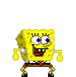

# BungeeBob

### Background

BungeeBob is a Doodle Jump clone.  Bounce from platform to platform, the higher you go, the higher your score!

### Functionality & MVP 

Users will be able to:

+  Start the game
+  Move BungeeBob left and right as he jumps

There will also be 

+  An instructions page with gameplay directions
+  A production README

### Wireframes

### Architecture and Technologies

BungeeBob uses the folliwing technologies:

+  `JavaScript` for game logic
+  `Canvas` for game play and animation

Files should be broken down into atleast

+  game.js
+  jumper.js
+  platform.js
+  bungeeBob.js

### Implementation Timeline

**Day 1**: Familiarize myself with Canvas, and begin set up of gameboard and platforms

**Day 2**: Continue with platforms and begin logic for jumper

**Day 3**: Continue fine tuning jumper. Implement upward level scroll and score tracker.

**Days 4 and 5**: Finish Jumper. Add extra bounce functionality to certain platforms.  Polish styling

### Bonus features

If there is extra time, I may introduce some jellyfish to collect as bonus points to boost the score.
