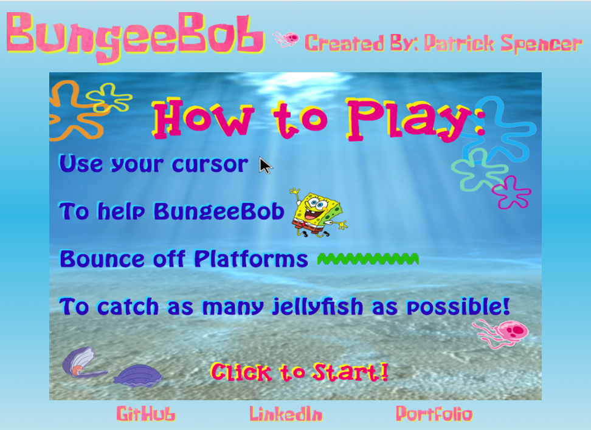
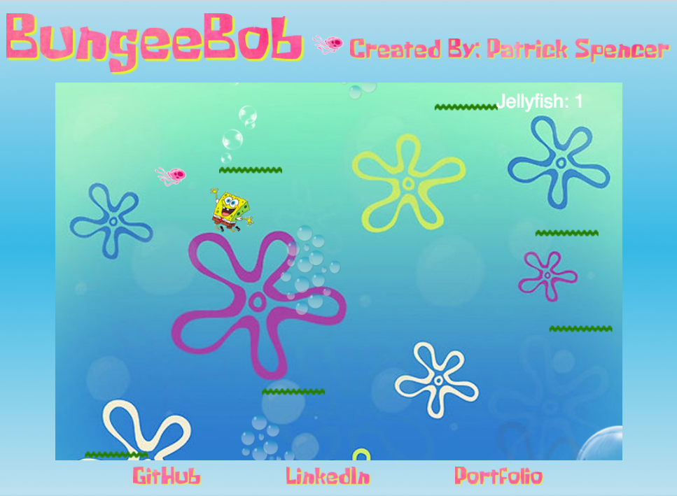

# BungeeBob
A whimsical take on the contemporary classic: Doodle Jump.

[BungeeBob Live](http://www.patrick-spencer.nyc/BungeeBob/)

## Instructions
### Gameplay
Use your cursor to help BungeeBob  jump from platform to platform and collect as many Jellyfish as possible.
The longer you play, the faster the platforms move, so collect those Jellyfish quick.
Check your Jellyfish score in the top right corner!

### Controls
- Click the screen to start a new game.
- BungeeBob will follow your cursor, so drag him left and right to navigate up the platforms

## Technologies and Techniques Used
- HTML5/CSS3
- HTML 5 Canvas
- Vanilla JavaScript
- Object-Oriented Programming
